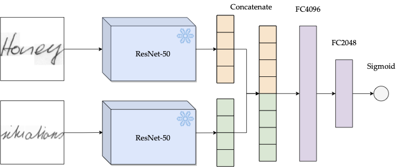
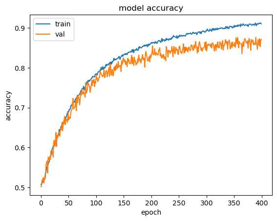

# Introduction
This codebase represents the scripts that were used in the bachelor's thesis called
"Siamese Convolutional Neural Networks In Handwriting Verification Using Word Texts".
Each file is explained below.

# Model architecture
The model architecture can be observed below.

# Example training
An example of a training session can be seen below.

# Code
## data.zip
Contains all the pre-processed data that was used in this project:
- CVL_100: Samples originating from the CVL database (downloaded from https://cvl.tuwien.ac.at/research/cvl-databases/an-off-line-database-for-writer-retrieval-writer-identification-and-word-spotting/)
- IAM_100: Samples originating from the IAM database (downloaded from https://fki.tic.heia-fr.ch/databases/iam-handwriting-database)
- Mixed_padded: Mixed database containing all samples from CVL_100 and IAM_100.

## grayscaling.py
Script that converts images in a folder to grayscale format.

## padding.py
Script that resizes and adds white padding pixels to images to convert them to square images of 256 by 256.

## test.py
Tests a certain trained model on a certain testing dataset of the same form.

## train.py
Trains a certain model on a training dataset containing a training and validation set of the same form.